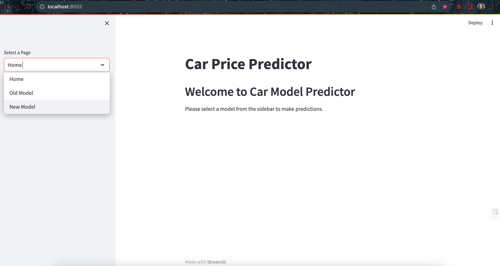
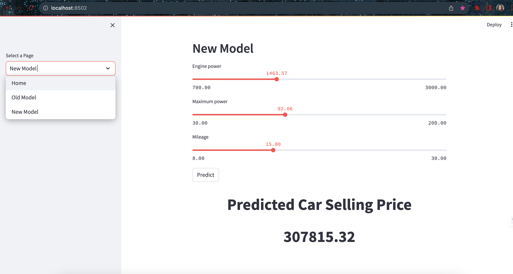

To run the app:
1. Run docker compose up. This will run docker for mlflow and python to run the app.
2. Go to 0.0.0.0:5001 in your browser to verify if the mlflow is working.
3. Go to the app directory in this root directory.
4. Then Build the docker image for streamlit that will host the car_price_prediction website in your localhost:
    - `docker build -t streamlit-app2 .`
3. Run the docker container:
    - `docker run -itd -p 8502:8501 -v .:/app streamlit-app2`
4. Execute the main.py by going inside the docker container
    - `docker exec -it <container_name> bash`
    - `streamlit run main.py`
5. Check the url : localhost:8502 to see the website up and running.

The above program will give the following output 
We will have a homepage with instruction to user to select one model from side bar

When user selects new-model

When user selects old-model

